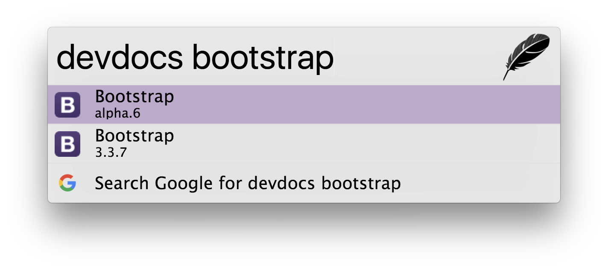

# zazu-devdocs

> [Zazu](https://github.com/tinytacoteam/zazu) plugin to search for API documentations with [devdocs.io](https://devdocs.io/)

[](https://travis-ci.org/danielbayerlein/zazu-devdocs)
[](https://codecov.io/gh/danielbayerlein/zazu-devdocs)
[](https://standardjs.com)
[](https://greenkeeper.io/)

## Usage

To search API documentations type `devdocs` then the name of the documentation to search for.
For example `devdocs bootstrap`.



## Install

Add `danielbayerlein/zazu-devdocs` inside of `plugins` block of your `~/.zazurc.json` file.

```json
{
  "plugins": [
    "danielbayerlein/zazu-devdocs"
  ]
}
```

## License

Copyright (c) 2017 Daniel Bayerlein. See [LICENSE](./LICENSE.md) for details.
